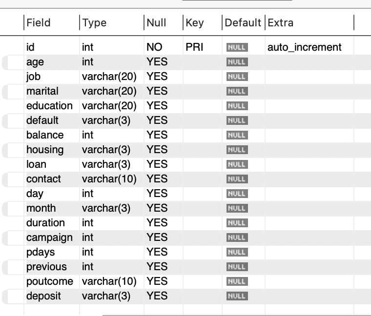
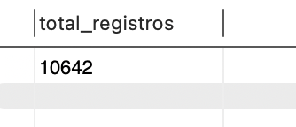
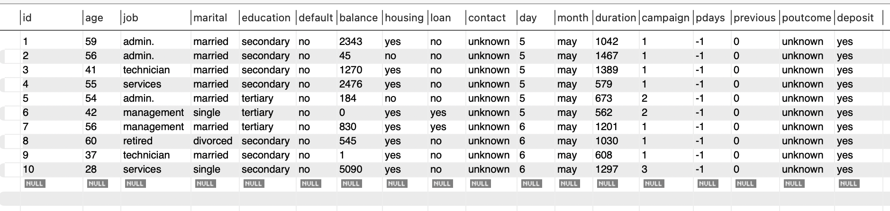
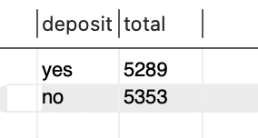
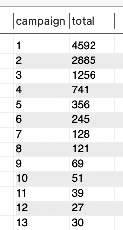
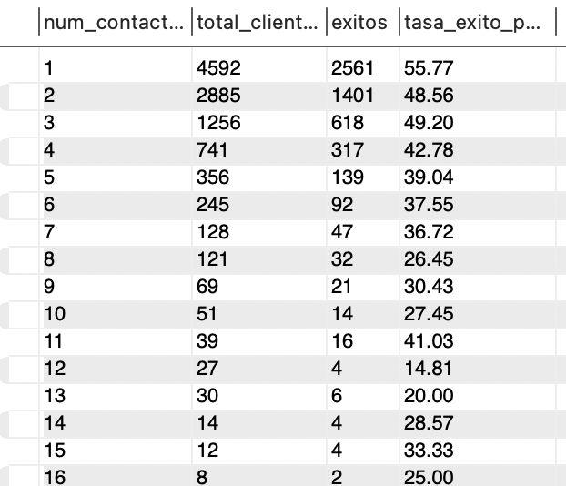
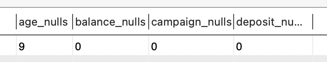

## Familiarización del Dataset

### Objetivo
Realizar una primera exploración del dataset para comprender su estructura, calidad de datos y variables clave, como base para el análisis de campañas de marketing bancario.

---

### Metodología
Se ha utilizado MySQL para llevar a cabo una exploración inicial del dataset mediante:

- Revisión de la estructura de la tabla  
- Análisis del volumen de datos  
- Identificación de la variable objetivo  
- Exploración de variables clave como el número de contactos (`campaign`)  
- Cálculo de la tasa de éxito en función del número de contactos  
- Revisión de valores nulos  
- Obtención de estadísticas básicas  

---

## Hallazgos Iniciales

- La variable objetivo identificada es `deposit`, que indica si el cliente acepta la campaña  
- La variable `campaign` representa el número de contactos realizados  
- Se observa que la tasa de éxito no sigue una relación lineal con el número de contactos  
- Los clientes con más intentos de contacto pueden presentar menor probabilidad de conversión  

---

### Notas despues de la reunion (Martes 21/04/2026):

- ¿Qué son las filas del dataset?
R/. Cada fila es un cliente, es decir, que la unidad de registro y por ende, la granularidad de la base de datos es un cliente

- ¿Cómo se van a tratar los valores faltantes? - Perfil cliente:
R/. Buscar estrategias de imputación.
Consejo: valorar estrategias que consideren el valor conjunto con otras variables
--> esto sobre las 21 filas que tienen info faltante en alguna de las columnas demograficas.

- hay un warning en la documentación del dataset --> es importante sobre una variable (Fede)

- shout-out a finanzas por el tema de los nulls en el poutcome 

---

### Warning: Data Leakage - Variable `duration`
La variable `duration` presenta un problema de data leakage, ya que contiene información posterior a la interacción con el cliente. Aunque tiene un alto poder predictivo, no es útil en un escenario real donde se pretende predecir el resultado antes de la llamada. Por ello, se excluye del modelo para mantener la validez del análisis.

---

### Evidencias

#### Estructura de la tabla

#### Número total de registros

#### Vista rápida de los datos

#### Distribución de la variable objetivo

#### Distribución de contactos

#### Relación contactos vs tasa de éxito

#### Valores nulos

